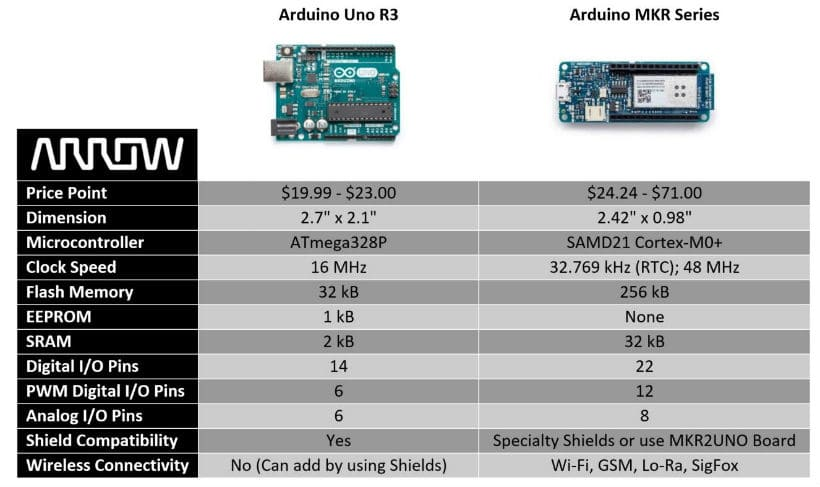
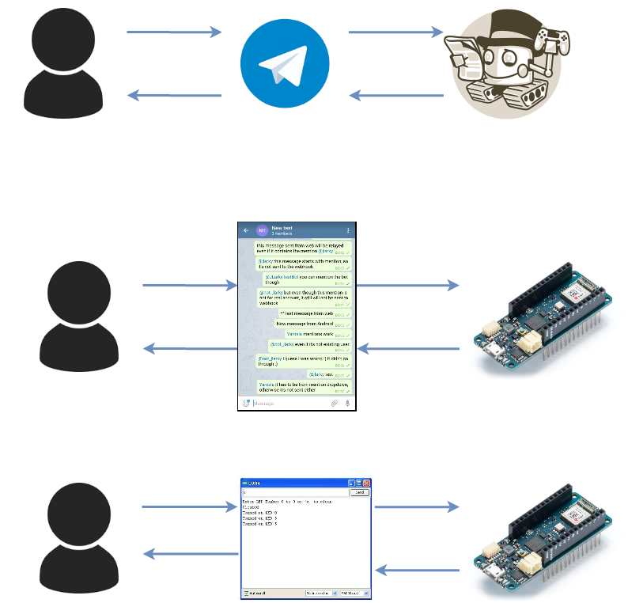

# Perchè?

* Vorrei accendere una lampada a distanza
* Vorrei scaldare casa caldaia mentre sto tornando da un viaggio
* Voglio far partire la lavatrice un'ora prima di rientrare a casa
* Vorrei conoscere la temperatura di casa

## Perchè Telegram?

Perchè con WhatsApp non si può.

Perchè Telegram mette a disposizione delle API per parlare con i BOT.

Cioè mette a disposizione dei programmatori degli strumenti molto utili. E noi li useremo per far parlare il nostro Bot.

## Cosa sono i Bot?

Sono dei servizi automatizzati, programmati con delle logiche più o meno complesse.

## Cosa sarà il nostro BOT?

Sarà una conversazione in cui scriveremo delle parole chiave che verranno lette da una applicazione Arduino attraverso delle librerie.

Il nostro Arduino, opportunamente programmato, svolgerà dei compiti dopo aver riconosciuto tali parole chiave.

Alla fine del compito, risponderà con un messaggio di conferma.

# MKR Family

 

## In origine
https://store.arduino.cc/arduino-mkrzero


## WiFi
https://store.arduino.cc/arduino-mkr1000


https://store.arduino.cc/arduino-mkr1000-with-headers-mounted


## Evoluzione WIFi
https://store.arduino.cc/mkr-wifi-1010


## Altri membri della famiglia

https://store.arduino.cc/arduino-mkrfox1200

https://store.arduino.cc/mkr-wan-1300

https://store.arduino.cc/mkr-gsm-1400

https://store.arduino.cc/arduino-mkr-nb-1500

https://store.arduino.cc/mkr-vidor-4000


# Prima facciamo funzionare le _Things_, poi penseremo all'_Internet_



Esempio comunicazione Seriale.
Modifichiamo l'esempio Blink per effettare delle operazioni in corrispondenza di lettura stringhe

```java
// the setup function runs once when you press reset or power the board
void setup() {
  // initialize digital pin LED_BUILTIN as an output.
  pinMode(LED_BUILTIN, OUTPUT);
  Serial.begin(9600);
}

// the loop function runs over and over again forever
void loop() {


  if (Serial.available() > 0) {

    String myRead = Serial.readStringUntil('\r');

    Serial.println(myRead);
    if (myRead == "ON") {
      digitalWrite(LED_BUILTIN, HIGH);   // turn the LED on (HIGH is the voltage level)
    }

    if (myRead == "OFF") {
      digitalWrite(LED_BUILTIN, LOW);    // turn the LED off by making the voltage LOW
    }
  }
  
}
```


# Servomotore
https://www.arduino.cc/en/reference/servo 
## PWM
PWM per controllare luminosità di un LED


PWM per controllare posizione di un servo


PWM per controllare movimento di un servo


```java
// modifichiamo esempio Arduino - knob
// per far posizionare servo con comandi attraverso comunicazione seriale

#include <Servo.h>

Servo myservo;                                // create servo object to control a servo

int servoPin = 13;                            // analog pin used to connect the potentiometer

void setup() {
  
  pinMode(LED_BUILTIN, OUTPUT);               // initialize digital pin LED_BUILTIN as an output.
  Serial.begin(9600);
  myservo.attach(13);                         // attaches the servo on pin 9 to the servo object
  myservo.write(0);                           // sets the servo position
  
}

void loop() {

  if (Serial.available() > 0) {

    String myRead = Serial.readStringUntil('\r');

    Serial.println(myRead);
    if (myRead == "ON") {
      myservo.write(90);                     // sets the servo position
    }

    if (myRead == "OFF") {
      myservo.write(0);                     // sets the servo position
    }
  
  if (myRead == "PUSH") {
      myservo.write(0);                     // sets the servo position
      delay(1000);
      myservo.write(90);                    // sets the servo position
      delay(1000);
      myservo.write(0);                     // sets the servo position
    }

  }
  
}
```


Quindi siamo capaci di far compiere delle operazioni all'Arduino in funzione di alcuni messaggi testuali inviati.

Adesso ci basta cambiare il mezzo di trasmissione dei messaggi:

non più la comunicazione seriale, ma un messaggio __Telegram__.


Costruiamo il nostro nuovo canale di comunicazione.

Per prima cosa creiamo il nostro finto interlocutore, il __Bot__.

Per farlo dobbiamo inviare una richiesta ad un superbot, cioè __BotFather__.

Per comodità possiamo usare __Telegram Web__:

https://web.telegram.org/

adesso cerchiamo BotFather


https://telegram.me/botfather

e creiamo un bot come descritto qui:

https://core.telegram.org/bots#6-botfather


Adesso ciascuno di noi ha un proprio interlocutore.

Cerchiamolo!

...

Come vediamo non ci risponde.

Lanciamo Arduino e diamo al Bot delle abilità.

Per prima cosa scarichiamo la libreria WifiNINA, del tutto simile alla libreria Wifi, ma realizzata appositente per il modulo Wifi NINA montato sul nostro Arduino MKR 1010. 

https://www.arduino.cc/en/Guide/MKRWiFi1010 

https://www.arduino.cc/en/Reference/WiFiNINA


Lanciamo un paio di esempi per prendere dimestichezza con le funzionalità del WiFi. 

https://www.arduino.cc/en/Tutorial/WiFiNINAScanNetworks

https://www.arduino.cc/en/Tutorial/WiFiNINAWiFiPing


# Relè


