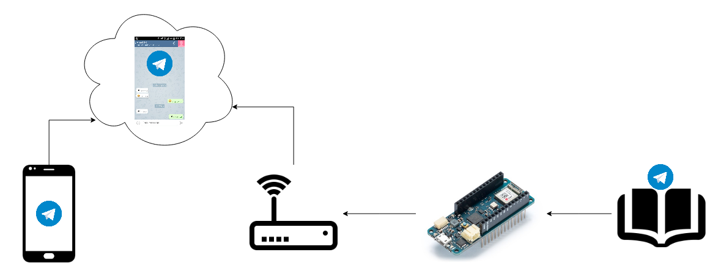

# Comandare Arduino attraverso Telegram: perchè?

* Vorrei accendere una lampada a distanza
* Vorrei scaldare casa mentre sto tornando da un viaggio
* Voglio far partire la lavatrice un po' prima di rientrare a casa
* Vorrei conoscere la temperatura di casa quando sono lontano
* Ma anche tanto altro:


## Perchè Telegram?

Perchè con WhatsApp non si può.

Perchè Telegram mette a disposizione delle API per parlare con i BOT.

Cioè mette a disposizione dei programmatori degli strumenti molto utili. E noi li useremo per far parlare il nostro Bot.

## Cosa sono i Bot?

Sono dei servizi automatizzati, programmati con delle logiche più o meno complesse.

## Che forma avrà il nostro BOT?

Ci sarà una conversazione in cui scriveremo delle parole chiave, che verranno lette da un Arduino attraverso delle apposite librerie.

Il nostro Arduino, opportunamente programmato, svolgerà dei compiti dopo aver riconosciuto tali parole chiave.

Dopo aver svolto delle operazioni, risponderà con un messaggio di conferma.

# Cosa ci serve?
 
* MKR WiFi 1010
* Micro Servo SG90
* Jumper Maschio/Maschio
* Connessione WiFi
* Smartphone + Telegram 
* Cavo USB per programmazione/alimentazione
* PC con installato Arduino

# Scegliamo lo strumento giusto: MKR Family

 

## In origine
https://store.arduino.cc/arduino-mkrzero


## WiFi
https://store.arduino.cc/arduino-mkr1000


https://store.arduino.cc/arduino-mkr1000-with-headers-mounted


## Evoluzione WIFi
https://store.arduino.cc/mkr-wifi-1010


## Altri membri della famiglia

https://store.arduino.cc/arduino-mkrfox1200

https://store.arduino.cc/mkr-wan-1300

https://store.arduino.cc/mkr-gsm-1400

https://store.arduino.cc/arduino-mkr-nb-1500

https://store.arduino.cc/mkr-vidor-4000


# Scomponiamo il problema 


# Fase 1: _Things_

Potrebbe essere necessario installare un _package_ per gestire la MKR1010:


dopodichè, possimo lanciare il nostro primo esempio: Blink.


Modifichiamo l'esempio Blink per effettare delle operazioni in corrispondenza di lettura stringhe.

```java
// the setup function runs once when you press reset or power the board
void setup() {
  // initialize digital pin LED_BUILTIN as an output.
  pinMode(LED_BUILTIN, OUTPUT);
  Serial.begin(9600);
}

// the loop function runs over and over again forever
void loop() {


  if (Serial.available() > 0) {

    String myRead = Serial.readStringUntil('\r');

    Serial.println(myRead);
    if (myRead == "ON") {
      digitalWrite(LED_BUILTIN, HIGH);   // turn the LED on (HIGH is the voltage level)
    }

    if (myRead == "OFF") {
      digitalWrite(LED_BUILTIN, LOW);    // turn the LED off by making the voltage LOW
    }
  }
  
}
```


# Servomotore
https://www.arduino.cc/en/reference/servo 

## PWM
PWM per controllare luminosità di un LED


PWM per controllare posizione di un servo


PWM per controllare movimento di un servo


```java
// modifichiamo esempio Arduino - knob
// per far posizionare servo con comandi attraverso comunicazione seriale

#include <Servo.h>

Servo myservo;                                // create servo object to control a servo

int servoPin = 13;                            // analog pin used to connect the potentiometer

void setup() {
  
  pinMode(LED_BUILTIN, OUTPUT);               // initialize digital pin LED_BUILTIN as an output.
  Serial.begin(9600);
  myservo.attach(servoPin);                   // attaches the servo on pin 13 to the servo object
  myservo.write(0);                           // sets the servo position
  
}

void loop() {

  if (Serial.available() > 0) {

    String myRead = Serial.readStringUntil('\r');

    Serial.println(myRead);
    if (myRead == "ON") {
      myservo.write(90);                     // sets the servo position
    }

    if (myRead == "OFF") {
      myservo.write(0);                     // sets the servo position
    }
  
  if (myRead == "PUSH") {
      myservo.write(0);                     // sets the servo position
      delay(1000);
      myservo.write(90);                    // sets the servo position
      delay(1000);
      myservo.write(0);                     // sets the servo position
    }

  }
  
}
```
Quindi siamo capaci di far compiere delle operazioni all'Arduino in funzione di alcuni messaggi testuali inviati.

Adesso ci basta cambiare il mezzo di trasmissione dei messaggi:

non più la comunicazione seriale, ma un messaggio __Telegram__.

# Fase 2: _Internet_

## Creiamo il Bot

Costruiamo il nostro nuovo canale di comunicazione.

Per prima cosa creiamo il nostro finto interlocutore, il __Bot__.

Per farlo dobbiamo inviare una richiesta ad un superbot, cioè __BotFather__.

Per comodità possiamo usare __Telegram Web__:

https://web.telegram.org/

Cerchiamo BotFather


https://telegram.me/botfather

e creiamo un bot come descritto nella documentazione ufficiale Telegram:

https://core.telegram.org/bots#6-botfather


Adesso ciascuno di noi ha un proprio interlocutore.

Scriviamogli qualcosa!

...

...

...

Come vediamo non ci risponde.

## Funzionalità WiFi della nostra scheda MKR 1010

Lanciamo Arduino e diamo al Bot delle abilità.

Per prima cosa scarichiamo la libreria WifiNINA, del tutto simile alla libreria Wifi, ma realizzata appositente per il modulo NINA montato sul nostro Arduino MKR 1010. 

https://www.arduino.cc/en/Guide/MKRWiFi1010 

https://www.arduino.cc/en/Reference/WiFiNINA


__NB: CONTROLLO PRELIMINARE FIRMWARE E RELEASE LIBRERIA__

* CheckFirmwareVersion.ino

```
WiFiNINA firmware check.

Firmware version installed: 1.0.0
Latest firmware version available : 1.2.0

Check result: NOT PASSED
 - The firmware version on the module do not match the
   version required by the library, you may experience
   issues or failures.
```

* FirmwareUpdate.ino

    1. Download and install the hourly Arduino IDE build.
    
    2. Launch the hourly IDE release and use the IDE's library manager (Sketch -> Include Library -> Manage Libraries ...) to install/update the following libraries: WiFiNINA, ArduinoBLE
    
    3. Plug in the MKR WiFi 1010 board into your PC with a USB cable.
    
    4. Select MKR WiFi 1010 as the board and it's serial port in the Tools menu of the IDE.
    
    5. Open the WiFiNINA Firmware Updater example sketch: File -> Examples -> WiFiNINA -> Tools -> FirmwareUpdater
    
    6. Upload the sketch onto your board.
    
    7. If the Serial Monitor is open, close it.
    
    8. Launch the "WiFi 101 / NINA Firmware Updater" from the Tools menu of the IDE
    
    9. Select the Serial Port for your board. The latest version of firmware for the NINA will be automattically selected.
    
    10. Click the "Update Firmware" button, and wait for the update to complete.
    
    11. Close the Updater.
    
    12. You can check the version of firmware loaded on the NINA using the Check Version example of the WiFiNINA library: File -> Examples -> WiFiNINA -> Tools -> CheckVersion example sketch.

* CheckFirmwareVersion.ino

## Primi passi con il WiFi

Lanciamo un paio di esempi per prendere dimestichezza con le funzionalità del WiFi. 

https://www.arduino.cc/en/Tutorial/WiFiNINAScanNetworks

https://www.arduino.cc/en/Tutorial/WiFiNINAWiFiPing


## Libreria UniversalTelegramBot

https://github.com/witnessmenow/Universal-Arduino-Telegram-Bot

E' il fork di una libreria già esitente (https://github.com/Gianbacchio/ESP8266-TelegramBot) e si ispira anche ad una seconda libreria (https://github.com/CasaJasmina/TelegramBot-Library).

## Schema connessione




## EchoBot

Lanciamo un primo esempio, che non è per MKR1010, e modifichiamolo ad hoc.

https://github.com/witnessmenow/Universal-Arduino-Telegram-Bot/blob/master/examples/101/EchoBot/EchoBot.ino

Eliminiamo le due librerie non necessarie e inseiriamo la libreria WiFiNINA.h

```java
//#include <WiFiSSLClient.h>
//#include <WiFi101.h>
#include <WiFiNINA.h>
#include <UniversalTelegramBot.h>

```

e inseriamo i nostri dati per completare:

```java
// Initialize Wifi connection to the router
char ssid[] = "xxxxxxxxxxxxxxxxxxxxxxxx";              // your network SSID (name)
char password[] = "yyyyyyyyy";                              // your network key

// Initialize Telegram BOT
#define BOTtoken "XXXXXXXXX:XXXXXXXXXXXXXXXXXXXXXXXXXXXXXXXXXXX" // your Bot Token (Get from Botfather)
```

Analizziamo assieme il codice e facciamo un mash-up tra la nostra applicazione di controllo del servo e l'applicazione che ci permette di inviare messaggi di testo all'Arduino.

# Fase 3: _Internet of Things_

Mettiamo insieme il nostro primo programma di comando del servo e il nostro EchoBot:


## Rendiamo più sicura la nostra applicazione

Il bot deve accettare solo messaggi provenienti dal nostro account.

Ma io chi sono?

Chiediamolo a IDbot, il quale, alla richiesta

```
/getid
```

risponderà con un codice numerico univoco che corrisponde al proprio utente.

Inseriamo questa cifra per riconoscere il mittente all'interno del nostro programma:


## Extra

### Il Bot ci invia autonomamente informazioni sulla temperatura rilevata da un DB18B20


Ogni volta che la temeratura rilevata dal sensore esce da una range prestabilito invieremo un messaggio.

Come identifico il destinatario?

Devo scoprire il valore del ChatID:

https://www.emmecilab.net/come-trovare-lid-di-una-chat-telegram/

Quindi avremo come risultato:


